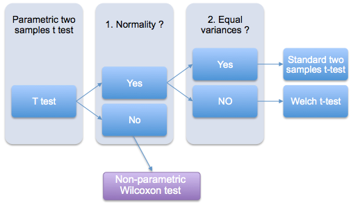

# Statistique (en 120 minutes :clock2:)

## Préambule

L'objectif, certes ambitieux, de ce document est de rassembler les outils statistiques
classiques pour mener à bien l'analyse de données expérimentales.

## 1. Terminologie

La statistique est un **chaînon important de la démarche scientifique**. En effet, afin de
valider une hypothèse théorique, les scientifiques formulent une question de recherche
qui sera testée à l'aide d'un protocole expérimental. Les outils statistiques permettent
d'analyser les données mesurées lors de l'expérimentation afin d'apporter des éléments de
réponse **objectifs** à la question initiale.

***population*** : l'ensemble des individus concernés par la question de recherche

***échantillon*** : sous-ensemble de la population participant à l'expérience

> Afin de pouvoir généraliser les résultats obtenus sur l'échantillon à
> l'ensemble de la population, celui-ci doit être **représentatif**.
> La méthode idéale pour constituer
> un échantillon consiste en un **tirage aléatoire** afin d'éviter tout biais.

***variable*** : une caractéristique étudiée par la question de recherche (sexe, âge,
taille, ville de naissance, ...)

> Les variables peuvent être de deux natures : 
> - quantitatives : représentées par une valeur numérique (âge, taille)
> - qualitatives : représentées par un attribut ou une classe (sexe, ville de naissance) 

Ce document, pour des raisons de temps, ne traite que des statistiques des variables quantitatives.

***jeu de données*** : un ensemble de variables mesurées pour chaque individu de 
l'échantillon. Celui-ci se présente sous la forme d'un tableau, les colonnes
représentant les variables et les lignes les individus composant l'échantillon.

Le fichier [L1-STAPS.xlsx](data/L1-STAPS.xlsx) servira de fil rouge pour illustrer
les différents outils statistiques abordés dans ce document. Il représente un
échantillon de 31 étudiants de Licence 1 STAPS avec les variables suivantes :
- Sexe
- Âge
- Pulsations cardiaques $P_0$, $P_1$ et $P_2$
- indices à l'issue des tests de [Ruffier](https://fr.wikipedia.org/wiki/Test_de_Ruffier) et [Ruffier-Dickson](https://fr.wikipedia.org/wiki/Test_de_Ruffier#Variante_:_indice_de_Ruffier-Dickson)
- Détente verticale mesurée avec une ceinture d'Abalakov et le test de Sargent
- Licence compétition

## 2. Statistique descriptive

L'objectif de la statistique descriptive est de **résumer** un jeu de données
à l'aide indices (que nous définirons par la suite) afin d'en faciliter la
compréhension.

### 2.1 Statistique univariée

Elle consiste à étudier une seule variable, indépendamment des autres. Cette
variable unique peut ainsi être résumée par des indices de natures différentes. 

#### 2.1.1 Indices de position

Ils rendent compte de la **position centrale** d'une variable dans l'intervalle des valeurs autorisées.

La ***moyenne*** $\mu$ est la somme des valeurs divisée par leur nombre.

$$
\bar{x} = \frac{1}{n}\sum_{i=1}^{n}{x_i}
$$

> :bar_chart: Parenthèse Excel
>
> fonction `MOYENNE(plage)`

La ***médiane*** est la valeur qui sépare la variable en deux parties de même effectif. 
Concrètement, on trie les valeurs de la variable dans l'ordre croissant et on extrait
la valeur à l'indice :
- $(n+1)/2$ si $n$ est impair
- $n/2$ sinon

> :bar_chart: Parenthèse Excel
>
> fonction `MEDIANE(plage)`

> Contrairement à la moyenne, la médiane est peu influencée par des valeurs aberrantes.
> Pour vous en convaincre, calculez la moyenne et la médiane de la variable Age du fichier
> [L1-STAPS.xlsx](data/L1-STAPS.xlsx) et remplacez une des valeurs par 50.

Enfin, le ***quantile*** $Q_p$ correspond à la valeur qui délimite les premiers $p$% de la variable. Si $p=50$%, $Q_p$ correspond à la médiane.

Les ***quartiles*** $Q_1$, $Q_2$ et $Q_3$ sont les quantiles correspondant respectivement à $25$%, $50$% (médiane) et $75$%.

> :bar_chart: Parenthèse Excel
>
> fonction `QUARTILE(plage, quart)`

#### 2.1.2 Indices de dispersion

Ils rendent compte de **l'étalement** des valeurs autour de la valeur centrale (moyenne ou médiane).

L'***étendue*** $e$ est la différence entre les valeurs extrémales de la variable.

$$
e = \max_{i}{x_i} - \min_{i}{x_i}
$$

> :bar_chart: Parenthèse Excel
>
> fonction `QUARTILE(plage, quart)` avec `quart` égal à `0` ou `4` retourne le minimum
> et la maximum de la variable contenue dans `plage`. 

L'***écart interquartiles*** correspond à $Q_3 - Q_1$.

L'***écart absolu moyen*** $e_m$ est la moyenne des écarts par rapport à la moyenne en valeur absolue.

$$
e_m = \frac{1}{n} \sum_{i=1}^{n}{ \lvert x_i - \bar{x} \rvert }
$$

La ***variance*** $V(x)$ est la moyenne quadratique des écarts par rapport à la moyenne.

$$
V(x) = \frac{1}{n} \sum_{i=1}^{n}{ (x_i - \bar{x})^2}
$$

L'***écart type*** $\sigma$ est la racine carrée de la variance.

$$
\sigma = \sqrt{ V(x) }
$$

Le ***coefficient de variation*** $c$ est le rapport entre l’écart-type et la moyenne, exprimé comme un pourcentage de la moyenne.

$$
c = \frac{\sigma}{\bar{x}}
$$

> L'écart type étant sensible à l'échelle des données, le coefficient
> de variation procède à une normalisation qui
> permet de comparer les dispersions de deux variables avec des 
> amplitudes différentes.

Ainsi, un couple d’indices de position et de dispersion permet de résumer sommairement une variable quantitative.

#### 2.1.3 Boîte à moustaches

Il est courant d'utiliser une représentation graphique pour décrire une variable
quantitative. [La boîte à moustaches](https://fr.wikipedia.org/wiki/Bo%C3%AEte_%C3%A0_moustaches) (ou boîte de Tukey) permet de fusionner plusieurs
indices de position et de dispersion.

> :bar_chart: Parenthèse Excel
>
> Création de [boîtes à moustaches](https://fr.extendoffice.com/excel/excel-charts/excel-create-box-and-whisker-chart.html)

### 2.2 statistique bivariée

Elle consiste à étudier la relation entre deux variables quantitatives.

#### 2.2.1 Diagramme de dispersion

Il est possible de générer un nuage points dont les coordonnées $(x_i, y_i)$
correspondent aux valeurs des deux variables étudiées.

Si le nuage de points est concentré autour d'une **droite**, on peut en déduire qu'il
existe une **relation linéaire** (ou de proportionnalité) entre les deux variables.

#### 2.2.2 Coefficient de corrélation linéaire (de Bravais-Pearson)

Le coefficient de corrélation linéaire $r(x, y)$ entre les variables $x$ et $y$ permet de
quantifier la **force de la relation linéaire** entre les deux variables (ou à quel point le nuage de points est **proche de la droite**).

$$
r(x, y) = \frac{Cov(x, y)}{\sigma_x \sigma_y} \qquad \text{où} \qquad  Cov(x,y )= \frac{1}{n} \sum_{i=1}^{n}{ (x_i - \bar{x})(y_i - \bar{y}) }
$$

Ce coefficient est compris dans l'intervalle $[-1, 1]$

- Proche de 1, les variables sont linéairement liées avec une droite de pente
 **positive** (quand la variable $x$ augmente, la variable $y$ augmente aussi)

- Proche de -1, les variables sont linéairement liées avec une droite de pente
 **négative** (quand la variable $x$ augmente, la variable $y$ diminue)

- Proche de 0, les variables ne sont pas linéairement liées. Cela ne veut pas dire qu'il n'existe pas de relation de type $y = f(x)$ mais dans ce cas la fonction $f$ n'est pas linéaire.

#### 2.2.3 Régression linéaire

Dans un cas de corrélation linéaire (avec $r(x,y)$ proche de 1 ou -1), il est possible de déterminer l'équation $y = ax + b$ de la droite la plus proche du nuage de points.

$$
a = \frac{Cov(x,y)}{V(x)}
$$

$$
b = \bar{y} - a \bar{x}
$$

> :bar_chart: Parenthèse Excel
>
> fonction `DROITEREG(Y;X)`

## 3. Statistique inférentielle

L'objectif de la statistique inférentielle est de **généraliser** une observation
réalisée sur un échantillon à l'ensemble de la population.

La démarche consiste à formuler deux hypothèses de recherche :

- une ***hypothèse nulle*** $H_0$ stipulant qu'il n'existe pas de différence significative entre deux variables à l'échelle de la population.

> Le nom d'hypothèse nulle faire référence au fait que la soustraction des moyennes des deux 
> variables étudiées est **égale à zéro** ( $\mu_x - \mu_y = 0$ ).

- une ***hypothèse alternative*** $H_1$ pouvant prendre une des trois formes suivantes :
    
    - $\mu_x \neq \mu_y$ (hypothèse _bilatérale_) 
    - $\mu_x > \mu_y$ (hypothèse _unilatérale à droite_) 
    - $\mu_x < \mu_y$ (hypothèse _unilatérale à gauche_) 

> Pour une hypothèse unilatérale, le choix du sens de l'inégalité est dicté
> par la tendance observée au sein de l'échantillon.

Le test statistique (choisi en fonction de la nature des données) retourne une ***p valeur*** $p$ qui correspond à la probabilité de réalisation de l'observation sachant que l'hypothèse nulle $H_0$ est vraie.

$$
p = \mathbb{P}(x \mid H_0)
$$

### Interprétation de la p valeur

- Si $p$ est inférieure à $5$% ( $p < 0.05$ ) alors la probabilité de
 rejeter l'hypothèse $H_0$ par erreur est quasiment nulle. On peut alors 
 rejeter $H_0$ au profit de l'hypothèse alternative $H_1$ et conclure à une 
 ***différence statistiquement significative*** entre les variables $x$ et
  $y$ à l'échelle de la population.

- Si $p$ est supérieure ou égale à $5$% ( $p \geq 0.05$ ) alors 
l'hypothèse nulle ne peut être rejetée au profit de l'hypothèse 
alternative. Dans ces conditions, on ne peut tirer ***aucune conclusion*** à l'échelle de la population au vu des données de l'échantillon.

> ATTENTION ! On ne peut jamais valider $H_0$. 

### 3.1 Test de Student

Ce test d'hypothèse ***paramétrique*** peut être utilisé pour des groupes indépendants
ou appariés à condition que :
- la distribution de chaque variable soit **normale** (test de Shapiro-Wilk)
- les variances soient **égales** (Test de Fisher)

Source : Statistical Tools For High-Throughput Data Analysis (http://www.sthda.com)

> :bar_chart: Parenthèse Excel
>
> Il n'existe pas de fonction Excel pour réaliser un test de Shapiro-Wilk mais on trouve
> facilement des versions en [ligne](http://sthda.com/french/rsthda/shapiro-wilk.php). Une version au format Excel est aussi télécheargeable sur le site [Anastats](https://www.anastats.fr/telechargements/).
>
>
> fonction `F.TEST(plage1;plage2)` pour réaliser un test de Fisher
>
> fonction `T.TEST(plage1;plage2;uni/bilatéral;type)` pour réaliser un test de Student 
>
> Dans le cas d'un test unilatéral, la fonction Excel s'appuie sur une hypothèse unilatérale à droite. La `plage1` doit
> donc correspondre au sous-échantillon avec la moyenne la plus élevée.
>
> | `type` | description                     |
> |:------:|---------------------------------|
> |  1     | données appariées               |
> |  2     | données avec variances égales   |
> |  3     | données avec variances inégales |
>
> La fonction Excel `T.TEST` permet d'effectuer un test de Student même si
> les variances ne sont pas égales, à condition de choisir judicieusement
> le paramètre `type`.

### 3.2 Test de Mann-Whitney

Ce test ***non paramétrique*** est à réaliser avec des groupes **indépendants** dont les valeurs ne suivent pas la loi normale.

> :bar_chart: Parenthèse Excel
>
> Comme pour le test de Shapiro-Wilk, il n'existe pas de fonction Excel pour réaliser un test non paramétrique mais on trouve facilement des calculateurs en [ligne](https://www.socscistatistics.com/tests/mannwhitney/default2.aspx). Une version au format Excel est aussi télécheargeable sur le site [Anastats](https://www.anastats.fr/telechargements/).
